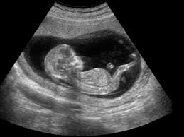
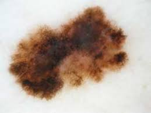
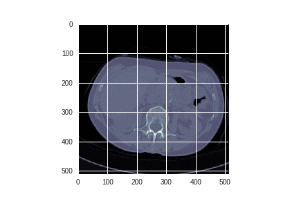

# Medical image

Ordenados de menor a mayor intrusividad

- Ultrasonidos
  - Ecografía
- Luz visible
  - Microscopía (tejidos celulares)
  - Fundoscopia (ojo)
  - Dermatoscopia (lunares)
  - Endoscopia
- Infrarojos
  - Termografía
- Rayos X
  - Radiografía convencional.
  - Radiografía digital (CR).
  - Tomografía axial computerizada (TAC) (3D)
- Medicina nuclear
  - Resonancia magnética nuclear (RMN) (3D)
- Medicina nuclear (rayos gamma)
  - Tomografía por emisión de positrones (PET)
  - Gammagrafía
  - SPECT (single photon emission computed tomography)

Image                                      |  Type              | Possible issue       | Database
-------------------------------------------|--------------------|----------------------|----------
   | Ecografy           |  ?                   | 
 | Dermoscopy (skin)  | Melanoma             |
 | Fundoscopy (eye)   | Diabetic retinopathy | [Kaggle competition](https://www.kaggle.com/c/diabetic-retinopathy-detection/data)
  | Histology (cells)  | Cancer               | [Kaggle competition](https://www.kaggle.com/c/histopathologic-cancer-detection)
 | Chest xray         | Pneumonia, pneumotorax, tuberculosis, lung cancer | [Kaggle competition](https://www.kaggle.com/c/rsna-pneumonia-detection-challenge), [pneumonia dataset](https://www.kaggle.com/paultimothymooney/chest-xray-pneumonia) [tuberculosis dataset](https://www.kaggle.com/kmader/pulmonary-chest-xray-abnormalities)
 | Dermoscopy (skin)  | Melanoma             |

### Ecografía
Matriz de pares emisores/receptores de sonido y su eco

Disposición
- En paralelo
- Radial

Se puede además usar el efcto doppler para detectar el movimiento

Además si hacen varias tomas se puede tener una ecografía en 3D

### Microscopía

- Extracción de tejidos (biopsia)
- Se suelen usar tintes pq sino se vería todo tranparente (para pared, nucleo de la célula...)
- Poco angulo (distancia foacle grande)

### Endoscopia
- Mucho angulo (distancia foacle pequeña)
- Hay que acompañar de luz pq el cuerpo está oscuro

### Termografía
- Infrarojos medios lejanos del rango visible
- Mayor raciación infraroja -> mayor temp
- 1 canal de 14 bits por pixel
- Usos
  - Se usa para saber si no llega la circulación
  - Si hay mucha temp. puede haber algún trompo
  - Se puede usar para saber si hay cancer de mama

### Radiografía
- Emisor delante del cuerpo, y receptor detrás
- Es igual si el sujeto se da la vuelta
- Invenientes: Con los rayos x que se quedan, impacatan contra molecuals y saltan electrones, Si es una molecula de ADN pued eproducirse una mutación genética.
- Equivale a 2 o 3 días bajo el sol(tomografía 4 años bajo el sol)
- 1 canal de 12-14 bits por pixel
- Bastante resolución (3000x5000 pixeles)
- Vemos las densidades (uds. Hausfield)
  - Huesos (lo más denso)
  - Agua: 1ud Hausfield

### Tomografía axial computerizada (TAC)
- Varias radiografías en distintos águlos
- Axial: Rotando alrededor de un eje
- Orden del ciento y pico radiografías
- Principio de radon: Varias tranformadas de Fourier (espacio de fourier es en 2D)
- Usos
  - Un tumor en la cabeza
  - Calcificación en la arteria aorta
  
### Resonancia magnética nuclear
- Vemos el tipo de estructura molecuar (distinto de densidades)
- Nueclos de los atomos son como imanes
- Si aplicamos un acamplo elecmagentico, los nucleos se alinean.
- Frecuencia de resonsancia: como vibra el atomo al alinearse, esa vibración es lo que se caputra.
- Gradiente de magnetización, de más a menos. Asi sabemos la zona del cuerpo.
- No se rompen enlaces atómicos (solo vibran)
- Además, se pueden aplicar tintes en las venas

### Gamagrafía
- Tiene poca resolución
- Se aplica una sustancia radiocativa
- Uso: funcionamiento de órganos

### SPECT
El TAC de las gammagrafías

### PET
El más nuevo y complejo de entender.

---

## TODO: Tabla comparativa

US: Ultra Sonido
MN: Medicina mnuclear (Gamagrafía y SPECT)

## Extra
Suelen tener 1 canal (en vez de 3, RGB) y este puede tener un rango mayor de 8 bits.

- Proyection
  - Perspetiva
  - Integral
  
Espectro de ondas
- Rango visible
- Infrarojos
- Radio
- Rayos X

# Antiguo

- Ultrasound (ecografía) bebés. Donde no halla hueso. Nada invasivo
- Electromagnetic field
  - MRI (Magnetic Resonance Imaging)
- X-ray
  - scintigrafy
  - sciascopy
  - sciasgraphy
  - CT (Computer Tomography) TAC son rayos X 3D
- Nuclear: involves the administration of a radiolabelled chemical called a radiopharmaceutical.
  - SPECT: single photon emission computed tomography. 3D image
  - PET: positron emission tomography. 3D image
- Camera
  - Endoscopy
