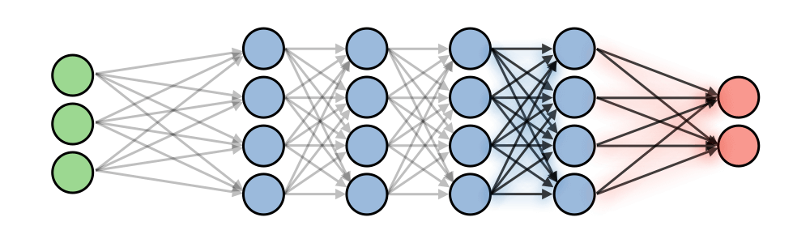

# 1. Basics

### Index
- [Introduction](#introduction)
- [Backpropagation](#backpropagation)
- [Epoch](#epoch)
- [Mini batch gradient descent](#mini-batch-gradient-descent)
- [Learning rate](#learning-rate)
- [Loss function](#loss-function)
- [Activation function](#activation-function)
- [Metrics](#metrics)
- Optimization
  - [Transfer learning](#transfer-learning)
- Regularization
  - [Dropout](#dropout)
  - [Weight regularization](#weight-regularization)
  - [Early stopping](#early-stopping) or patience

## Introduction
In a neural network, weights are updated as follows:

- **Step 1**: Take a batch of training data and perform forward propagation to compute the loss. 
- **Step 2**: Backpropagate the loss to get the gradient of the loss with respect to each weight. 
- **Step 3**: Use the gradients to update the weights of the network.

## Backpropagation 
Backpropagation is a method to update the weights in the neural network by taking into account the actual output and the desired output. The derivative with respect to each weight ***w*** is computed using the chain rule.

## Epoch
Is an iteration where the model sees the whole training set to update its weights.
> #### Rule of thumb!
> Between `1` and `5` if training with transfer learning. More than `10` when training from scratch.

### Learning rate
 
## Mini batch gradient descent
During the training phase, updating weights is usually not based on the whole training set at once due to computation complexities or one data point due to noise issues. Instead, the update step is done on mini-batches, where the number of data points in a batch is a hyperparameter that we can tune.

## Activation function

Used in intermediate layers:

ReLU |	Leaky ReLU	| ELU
-----|------------|----
  |  | 
`max(0,z)` | `max(e*z,z)` | TO-DO
Most used | Fix negative values issue | Differentiable everywhere

Used in final layer:

Softmax |	Sigmoid	| Tanh
-----|------------|----
  |   |  
`e^(x_i) / ∑ e^(x_i)` | `1 / 1 + e^(-x)` | `e^(x)-e^(-x) / e^(x)+e^(-x)`
Used in final layer:<ul><li>Sigle-label classification</li></ul> | Used in final layer:<ul><li>Multi-label classification</li><li>Binary classification</li></ul> | Differentiable everywhere
[pytorch](https://pytorch.org/docs/stable/nn.html#torch.nn.Softmax)

## Transfer learning
Training a deep learning model requires a lot of data and more importantly a lot of time. It is often useful to take advantage of pre-trained weights on huge datasets that took days/weeks to train, and leverage it towards our use case. Depending on how much data we have at hand, here are the different ways to leverage this:

Training size	| Illustration |	Explanation
:------------:|--------------|------------
Small	        |  | 	Freezes all layers, except last one.
Medium       	|  |	Freezes most layers, trains weights on last layers.
Large         |  | Trains on all layers (with pretrained weights).

## Dropout
Dropout is a technique used in neural networks to prevent overfitting the training data by dropping out neurons with probability `p>0`. It forces the model to avoid relying too much on particular sets of features.

> Remark: most deep learning frameworks parametrize dropout through the 'keep' parameter `1−p`.

## Weight regularization
