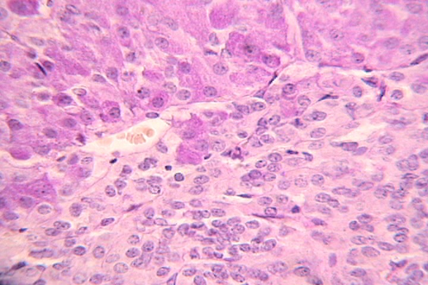
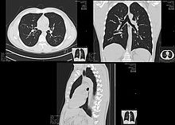

# Medical image

Ordenados de menor a mayor intrusividad.

- Ultrasonidos
  - Ecografía
- Luz visible
  - Fundoscopia (ojo)
  - Endoscopia (cavidad)
  - Dermatoscopia (lunares)
  - Microscopía (tejidos celulares)
- Infrarojos
  - Termografía
- Rayos X
  - Radiografía convencional
  - Radiografía digital (CR)
  - Tomografía axial computerizada (TAC) (3D)
- Medicina nuclear
  - Resonancia magnética nuclear (RMN) (3D)
- Medicina nuclear (rayos gamma)
  - Tomografía por emisión de positrones (PET)
  - Gammagrafía
  - SPECT (single photon emission computed tomography)

Image                                      |  Type              | Kaggle competition
-------------------------------------------|--------------------|-------------------
   | Ecografy           | [Ultrasound nerve segmentation](https://www.kaggle.com/c/ultrasound-nerve-segmentation)
   | Endoscopy          | [Cervical Cancer](https://www.kaggle.com/c/intel-mobileodt-cervical-cancer-screening)
 | Dermoscopy (skin)  | Melanoma detection
 | Fundoscopy (eye)   | [Diabetic retinopathy detection](https://www.kaggle.com/c/diabetic-retinopathy-detection)
  | Histology (cells)  | <ul><li>[Histopathologic cancer detection](https://www.kaggle.com/c/histopathologic-cancer-detection)</li><li>[Nuclei segmentation](https://www.kaggle.com/c/data-science-bowl-2018)</li></ul>
 | X-ray              | [Pneumonia detection](https://www.kaggle.com/c/rsna-pneumonia-detection-challenge)
   | CT                 | [Lung cancer detection](https://www.kaggle.com/c/data-science-bowl-2017)

### Ecografía (Ultrasound)
Matriz de pares emisores/receptores de sonido y su eco

Disposición
- En paralelo
- Radial

Se puede además usar el efcto doppler para detectar el movimiento

Además si hacen varias tomas se puede tener una ecografía en 3D

> An ultrasound device sends out sound waves that people cannot hear. The waves bounce off tissues inside your body like an echo. A computer uses these echoes to create a picture of areas inside your body. This picture is called a sonogram.

### Microscopía (Biopsy)

- Extracción de tejidos (biopsia)
- Se suelen usar tintes pq sino se vería todo tranparente (para pared, nucleo de la célula...)
- Poco angulo (distancia foacle grande)

In most cases, doctors need to do a biopsy to make a diagnosis of cancer. A biopsy is a procedure in which the doctor removes a sample of tissue. A pathologist  then looks at the tissue under a microscope to see if it is cancer. The sample may be removed in several ways:

- **With a needle**: The doctor uses a needle to withdraw tissue or fluid. 
- **With an endoscope**: The doctor looks at areas inside the body using a thin, lighted tube called an endoscope. The scope is inserted through a natural opening, such as the mouth. Then, the doctor uses a special tool to remove tissue or cells through the tube.
- **With surgery**: Surgery may be excisional or incisional.
  - In an **excisional** biopsy, the surgeon removes the entire tumor. Often some of the normal tissue around the tumor also is removed. 
  - In an **incisional** biopsy, the surgeon removes just part of the tumor.

### Endoscopia
- Mucho angulo (distancia foacle pequeña)
- Hay que acompañar de luz pq el cuerpo está oscuro

### Termografía
- Infrarojos medios lejanos del rango visible
- Mayor raciación infraroja -> mayor temp
- 1 canal de 14 bits por pixel
- Usos
  - Se usa para saber si no llega la circulación
  - Si hay mucha temp. puede haber algún trompo
  - Se puede usar para saber si hay cancer de mama

### Radiografía
- Emisor delante del cuerpo, y receptor detrás
- Es igual si el sujeto se da la vuelta
- Invenientes: Con los rayos x que se quedan, impacatan contra molecuals y saltan electrones, Si es una molecula de ADN pued eproducirse una mutación genética.
- Equivale a 2 o 3 días bajo el sol(tomografía 4 años bajo el sol)
- 1 canal de 12-14 bits por pixel
- Bastante resolución (3000x5000 pixeles)
- Vemos las densidades (uds. Hausfield)
  - Huesos (lo más denso)
  - Agua: 1ud Hausfield
  
> X-rays use low doses of radiation to create pictures of the inside of your body.

### Tomografía axial computerizada (TAC)
- Varias radiografías en distintos águlos
- Axial: Rotando alrededor de un eje
- Orden del ciento y pico radiografías
- Principio de radon: Varias tranformadas de Fourier (espacio de fourier es en 2D)
- Usos
  - Un tumor en la cabeza
  - Calcificación en la arteria aorta

> An x-ray machine linked to a computer takes a series of detailed pictures of your organs. You may receive a dye or other contrast material to highlight areas inside the body. Contrast material helps make these pictures easier to read.
  
### Resonancia magnética nuclear (MRI)
- Vemos el tipo de estructura molecuar (distinto de densidades)
- Nueclos de los atomos son como imanes
- Si aplicamos un acamplo elecmagentico, los nucleos se alinean.
- Frecuencia de resonsancia: como vibra el atomo al alinearse, esa vibración es lo que se caputra.
- Gradiente de magnetización, de más a menos. Asi sabemos la zona del cuerpo.
- No se rompen enlaces atómicos (solo vibran)
- Además, se pueden aplicar tintes en las venas

Registra la estructura estática (regiones)(distintas frecuencias-> distintos elementos)(resulucion espacial muy buena, menos de un mm, pero resolución temporal mala, casi 1 segundo

> A strong magnet linked to a computer is used to make detailed pictures of areas in your body. Your doctor can view these pictures on a monitor and print them on film.

##### fMRI
Registra la estructura funcional (se centra en presencia de oxígeno en sangre)(indicador indirecto de consumo de energía)

##### DTI (difussor tensor imaging)
detecta flujo de agua

### Gamagrafía (Nuclear scan)
- Tiene poca resolución
- Se aplica una sustancia radiocativa
- Uso: funcionamiento de órganos

> For this scan, you receive an injection of a small amount of radioactive material, which is sometimes called a tracer. It flows through your bloodstream and collects in certain bones or organs. A machine called a scanner detects and measures the radioactivity. The scanner creates pictures of bones or organs on a computer screen or on film. Your body gets rid of the radioactive substance quickly. This type of scan may also be called radionuclide scan.

### SPECT
El TAC de las gammagrafías

### PET
El más nuevo y complejo de entender. Consumes azúcar ligeramente radioactivo (sodio 22 en la glucosa)y al desintegrarse, se capta y se ve dónde se ha consumido energía. Max1 al año. Menos resolución que mri

> For this scan, you receive an injection of a tracer. Then, a machine makes 3-D pictures that show where the tracer collects in the body. These scans show how organs and tissues are working.

---

## TODO: Tabla comparativa

US: Ultra Sonido
MN: Medicina mnuclear (Gamagrafía y SPECT)

## Extra
Suelen tener 1 canal (en vez de 3, RGB) y este puede tener un rango mayor de 8 bits.

- Proyection
  - Perspetiva
  - Integral
  
Espectro de ondas
- Rango visible
- Infrarojos
- Radio
- Rayos X

# Antiguo

- Ultrasound (ecografía) bebés. Donde no halla hueso. Nada invasivo
- Electromagnetic field
  - MRI (Magnetic Resonance Imaging)
- X-ray
  - scintigrafy
  - sciascopy
  - sciasgraphy
  - CT (Computer Tomography) TAC son rayos X 3D
- Nuclear: involves the administration of a radiolabelled chemical called a radiopharmaceutical.
  - SPECT: single photon emission computed tomography. 3D image
  - PET: positron emission tomography. 3D image
- Camera
  - Endoscopy
