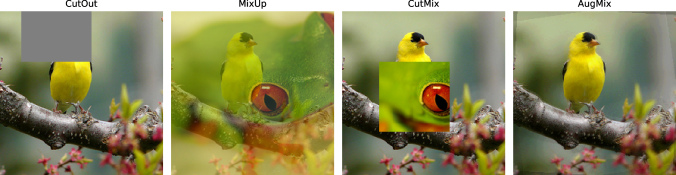

<p align="center"></p>

Here are my personal deep learning notes. I've written this cheatsheet for keep track my knowledge
but you can use it as a guide for learning deep learning aswell.

| 🗂 Data            | 🧠 Layers       | 📉 Loss         | 📈 Metrics   | 🔥 Training               | ✅ Production  |
|--------------------|-----------------|-----------------|-------------|----------------------------|----------------|
| Pytorch dataset    | [Weight init](#weight-init) | Cross entropy |    | [Optimizers](#optimizers)  | Ensemble       |
| Pytorch dataloader | [Activations](#activations) | Weight Decay  |    | Transfer learning          | TTA            |
| Split              | Self Attention  | [Label Smoothing](#label-smoothing) | | [Clean mem](#clean-mem)  | Pseudolabeling |
| Normalization      | Trained CNN     | Mixup           |             | [Half precision](#half-precision) | [Webserver](#webserver) (Flask) |
| Data augmentation  | [CoordConv](#corrdconv) | SoftF1          |             | [Multiple GPUs](#multiple-gpus) | Distillation   |
| Deal imbalance     |                 |                 |             | Precomputation             | [Pruning](#pruning) |
|                    |                 |                 |             | [Set seed](#set-seed)      | [Quantization](#quantization) (int8) |
|                    |                 |                 |             |            | [TorchScript](#torchscript)  |
|                    |                 |                 |             |            | [ONNX](#onnx)  |


## Useful links
https://github.com/lucidrains?tab=repositories
https://walkwithfastai.com/

---

<h1 align="center">🗂 Data</h1>

## Balance the data

If you can not get more data of the underrepresented classes, you can fix the imbalance with code:

- Fix it on the **dataloader `sampler`**:
  - [Weighted Random Sampler](https://pytorch.org/docs/stable/data.html#torch.utils.data.WeightedRandomSampler)
    - `torch.utils.data.WeightedRandomSampler(weights=[…])`
  - **Subsample majority class**. But you can lose important data.
    - `catalyst.data.sampler.BalanceClassSampler(labels=ds.targets, mode="downsampling")`
  - **Oversample minority class**. But you can overfit.
    - `catalyst.data.sampler.BalanceClassSampler(labels=ds.targets, mode="upsampling")`
- Fix it on the **loss function**:
  - `CrossEntropyLoss(weight=[…])`


<details>
<summary>Custom BalanceClassSampler</summary>
<p>

```python
class BalanceClassSampler(torch.utils.data.Sampler):
    """
    Allows you to create stratified sample on unbalanced classes.
    Inspired from Catalyst's BalanceClassSampler:
    https://catalyst-team.github.io/catalyst/_modules/catalyst/data/sampler.html#BalanceClassSampler

    Args:
        labels: list of class label for each elem in the dataset
        mode: Strategy to balance classes. Must be one of [downsampling, upsampling]
    """

    def __init__(self, labels:list[int], mode:str = "upsampling"):

        labels = np.array(labels)
        self.unique_labels = set(labels)

        ########## STEP 1:
        # Compute the final_num_samples_per_label
        # An Integer
        num_samples_per_label = {label: (labels == label).sum() for label in self.unique_labels}

        if   mode == "upsampling":   self.final_num_samples_per_label = max(num_samples_per_label.values())
        elif mode == "downsampling": self.final_num_samples_per_label = min(num_samples_per_label.values())
        else:                        raise Exception("mode should be: \"downsampling\" or \"upsampling\"")

        ########## STEP 2:
        # Compute actual indices of every label.
        # A Diccionary of lists
        self.indices_per_label = {label: np.arange(len(labels))[labels==label].tolist() for label in self.unique_labels}


    def __iter__(self): #-> Iterator[int]:

        indices = []
        for label in self.unique_labels:

            label_indices = self.indices_per_label[label]

            repeat_all_elementes  = self.final_num_samples_per_label // len(label_indices)
            pick_random_elementes = self.final_num_samples_per_label %  len(label_indices)

            indices += label_indices * repeat_all_elementes # repeat the list several times
            indices += random.sample(label_indices, k=pick_random_elementes)  # pick random idxs without repetition

        assert len(indices) == self.__len__()
        np.random.shuffle(indices) # Inplace shuffle the list

        return iter(indices)
    

    def __len__(self) -> int:
        return self.final_num_samples_per_label * len(self.unique_labels)
```
</p>
</details>
 
## Split in train and validation
- **Training set**: used for learning the parameters of the model. 
- **Validation set**: used for evaluating model while training. Don’t create a random validation set! Manually create one so that it matches the distribution of your data. Usaully a `10%` or `20%` of your train set.
  - N-fold cross-validation. Usually `10`
- **Test set**: used to get a final estimate of how well the network works.

## Normalization
Scale the inputs to have mean 0 and a variance of 1. Also linear decorrelation/whitening/pca helps a lot. Normalization parameters are obtained only **from train set**, and then applied to both train and valid sets.
- Option 1: **Standarization** `x = x-x.mean() / x.std()` *Most used*
   1. **Mean subtraction**: Center the data to zero. `x = x - x.mean()` fights vanishing and exploding gradients
   2. **Standardize**: Put the data on the same scale. `x = x / x.std()` improves convergence speed and accuracy
- Option 2: **PCA Whitening**
  1. **Mean subtraction**: Center the data in zero. `x = x - x.mean()`
  2. **Decorrelation** or **PCA**: Rotate the data until there is no correlation anymore.
  3. **Whitening**: Put the data on the same scale. `whitened = decorrelated / np.sqrt(eigVals + 1e-5)`
- Option 3: **ZCA whitening** Zero component analysis (ZCA).
- Other options not used:
  - `(x-x.min()) / (x.max()-x.min())`: Values from 0 to 1
  - `2*(x-x.min()) / (x.max()-x.min()) - 1`: Values from -1 to 1
  
> - In case of images, the scale is from 0 to 255, so it is not strictly necessary normalize.
> - [**neural networks data preparation**](http://cs231n.github.io/neural-networks-2/#datapre)


## Data augmentation

- **Cutout**: Remove parts
  - Parámetro: Elegir el tamaño correto de cuadrado: 16px por ejemplo.
- **Mixup**: Mix 2 samples (both x & y) `x = λxᵢ + (1−λ)xⱼ` & `y = λyᵢ + (1−λ)yⱼ`. [Fast.ai doc](https://docs.fast.ai/callback.mixup)
  - Parámetro: Elegir `λ` sampleando la **distribución beta**  α=β=0.4 ó 0.2 (Así pocas veces la imgs se mezclarán)
- **CutMix**: Mix 2 samples in some parts. [Fast.ai doc](https://docs.fast.ai/callback.cutmix)
- **AugMix**: No loos info.
- **[RandAugment](https://fastai.github.io/timmdocs/RandAugment)**
- **[AutoAugment](https://fastai.github.io/timmdocs/AutoAugment)**



> [WandB post with TF2 code](https://wandb.ai/authors/tfaugmentation/reports/Modern-Data-Augmentation-Techniques-for-Computer-Vision--VmlldzoxNzU3NTU)


#### Image data aug

| Augmentation | Description                          | Pillow                        |
|--------------|--------------------------------------|-------------------------------|
| Rotate       | Rotate some degrees                  | pil_img.rotate()              |
| Translate    |                                      | pil_img.transform()           |
| Shear        | Affine transform                     | pil_img.transform()           |
| Autocontrast | Equalize the histogram  (linear)     | PIL.ImageOps.autocontrast()   |
| Equalize     | Equalize the histogram  (non-linear) | PIL.ImageOps.equalize()       |
| Posterize    | Reducing pixel bits                  | PIL.ImageOps.posterize()      |
| Solarize     | Inverting colors above a threshold   | PIL.ImageOps.solarize()       |
| Color        |                                      | PIL.ImageEnhance.Color()      |
| Contrast     |                                      | PIL.ImageEnhance.Contrast()   |
| Brightness   |                                      | PIL.ImageEnhance.Brightness() |
| Sharpness    |  Sharpen or blurs the image          | PIL.ImageEnhance.Sharpness()  |

Interpolations when rotate, translate or affine:
- Image.BILINEAR
- etc


<h1 align="center">🧠 Model</h1>


## Weight init

Depends on the models architecture. Try to avoid vanishing or exploding outputs. [blog1](https://towardsdatascience.com/weight-initialization-in-neural-networks-a-journey-from-the-basics-to-kaiming-954fb9b47c79), [blog2](https://madaan.github.io/init/).
- **Constant value**: Very bad
- **Random**:
  - Uniform: From 0 to 1. Or from -1 to 1. Bad
  - Normal: Mean 0, std=1. Better
- **Xavier initialization**:  Good for MLPs with tanh activation func. [paper](http://proceedings.mlr.press/v9/glorot10a/glorot10a.pdf)
  - Uniform: 
  - Normal: 
- **Kaiming initialization**: Good for MLPs with ReLU activation func. (a.k.a. He initialization) [paper](https://arxiv.org/abs/1502.01852)
  - Uniform
  - Normal
  - When you use Kaiming, you ha to fix `ReLU(x)` equals to **`min(x,0) - 0.5`** for a correct mean (0)
- **Delta-Orthogonal initialization**: Good for vanilla CNNs (10000 layers). Read this [paper](https://arxiv.org/abs/1806.05393)

```python
def weight_init(m):

	# LINEAR
	if type(m) == nn.Linear:
		torch.nn.init.xavier_uniform(m.weight)
		m.bias.data.fill_(0.01)

	# CONVS
	classname = m.__class__.__name__
	if classname.find('Conv') != -1:
		nn.init.xavier_uniform_(m.weight, gain=nn.init.calculate_gain('relu'))
		nn.init.zeros_(m.bias)

model.apply(weight_init)
```

## Activations
> [reference](https://mlfromscratch.com/activation-functions-explained)
- **Softmax**: Sigle-label classification (last layer)
- **Sigmoid**: Multi-label classification (last layer)
- **Hyperbolic tangent**:
- **ReLU**: Non-linearity compontent of the net (hidden layers) check [this paper](https://arxiv.org/pdf/1710.05941.pdf)
- **ELU**: Exponential Linear Unit. [paper](https://arxiv.org/abs/1511.07289)
- **SELU**: Scaled Exponential Linear Unit. [paper](https://arxiv.org/abs/1706.02515)
- **PReLU** or **Leaky ReLU**:
- **GLU**: Gated Linear Unit. (from TabNet paper) [blog](https://medium.com/deeplearningmadeeasy/glu-gated-linear-unit-21e71cd52081) `linear1(x) * sigmoid(linear2(x))`
- **SERLU**:
- Smoother ReLU. Differienzable. **BEST**
  - **GeLU**: Gaussian Error Linear Units. Used in transformers. [paper](https://arxiv.org/abs/1606.08415). (2016)
  - **Swish**: `x * sigmoid(x)` [paper](https://arxiv.org/abs/1710.05941) (2017)
  - **Elish**: `xxxx` [paper](https://arxiv.org/abs/1808.00783) (2018)
  - **Mish**: `x * tanh( ln(1 + e^x) )` [paper](https://arxiv.org/abs/1908.08681) (2019)
  - **myActFunc 1** = `0.5 * x * ( tanh(x) + 1 )`
  - **myActFunc 2** = `0.5 * x * ( tanh (x+1) + 1)`
  - **myActFunc 3** = `x * ((x+x+1)/(abs(x+1) + abs(x)) * 0.5 + 0.5)`


## CoordConv

```python
class AddCoord2D(torch.nn.Module):
    def __init__(self, len):
        super(AddCoord2D, self).__init__()
        
        i_coord = torch.linspace(start=1/len, end=1, steps=len).view(len, -1).expand(-1, len)
        j_coord = torch.linspace(start=1/len, end=1, steps=len).view(-1, len).expand(len, -1)
        self.coords = torch.stack([i_coord, j_coord])

        print(self.coords.shape)

    def forward(self, x): # X shape: [BS, C, X, Y]
        BS = x.shape[0]
        return torch.cat((x, self.coords.expand(BS,-1,-1,-1)), dim=1)
```

<h1 align="center">🧐 Regularization</h1>

## Dropout
During training, some **neurons** will be deactivated **randomly**. [Hinton, 2012](http://www.cs.toronto.edu/~hinton/absps/dropout.pdf), [Srivasta, 2014](https://www.cs.toronto.edu/~hinton/absps/JMLRdropout.pdf)

<p align="center"></p>


## Weight regularization
Weight penalty: Regularization in loss function (penalice high weights). `Weight decay` hyper-parameter usually `0.0005`.

Visually, the weights only can take a value inside the blue region, and the red circles represent the minimum. Here, there are 2 weight variables.

L1 (LASSO) |	L2 (Ridge)	| Elastic Net
-----------|--------------|------------
 |  | 
Shrinks coefficients to 0. Good for variable selection | **Most used**. Makes coefficients smaller | Tradeoff between variable selection and small coefficients
Penalizes the sum of absolute weights | Penalizes the sum of squared weights | Combination of 2 before
`loss + wd * weights.abs().sum()` | `loss + wd * weights.pow(2).sum()` |


## DropConnect
At training and inference, some **connections** (weights) will be deactivated **permanently**. [LeCun, 2013](http://yann.lecun.com/exdb/publis/pdf/wan-icml-13.pdf). This is very useful at the firsts layers.

<p align="center"></p>


## Distillation

Knowledge Distillation (teacher-student) A **teacher** model teach a **student** model.

- **Smaller** student model → **faster** model.
  - Model compresion: Less memory and computation
  - To generalize and avoid outliers.
  - Used in NLP transformers.
  - [paper](https://arxiv.org/abs/1909.11723)
- **Bigger** student model is → **more accurate** model.
  - Useful when you have extra unlabeled data (kaggle competitions)
  - **1.** Train the teacher model with labeled dataset.
  - **2.** With the extra on unlabeled dataset, generate pseudo labels (soft or hard labels)
  - **3.** Train a student model on both labeled and pseudo-labeled datasets.
  - **4.** Student becomes teacher and repeat -> **2.**
  - [Paper: When Does Label Smoothing Help?](https://arxiv.org/abs/1906.02629)
  - [Paper: Noisy Student](https://arxiv.org/abs/1911.04252)
  - [Video: Noisy Student](https://youtu.be/Y8YaU9mv_us)


<h1 align="center">📉 Loss</h1>

## Loss function
- **Regression**
  - **MBE: Mean Bias Error**: `mean(GT - pred)` It could determine if the model has positive bias or negative bias.
  - **MAE: Mean Absolute Error (L1 loss)**: `mean(|GT - pred|)` The most simple.
  - **MSE: Mean Squared Error (L2 loss)**: `mean((GT-pred)²)` Penalice large errors more than MAE. **Most used**
  - **RMSE: Root Mean Squared Error**: `sqrt(MSE)` Proportional to MSE. Value closer to MAE.
  - Percentage errors:
    - **MAPE: Mean Absolute Percentage Error**
    - **MSPE: Mean Squared Percentage Error**
    - **RMSPE: Root Mean Squared Percentage Error**
- **Classification**
  - **Cross Entropy**: Sigle-label classification. Usually with **softmax**. `nn.CrossEntropyLoss`.
    - **NLL: Negative Log Likelihood** is the one-hot encoded target simplified version, see [this](https://jamesmccaffrey.wordpress.com/2016/09/25/log-loss-and-cross-entropy-are-almost-the-same/) `nn.NLLLoss()`
  - **Binary Cross Entropy**:  Multi-label classification. Usually with **sigmoid**. `nn.BCELoss`
  - **Hinge**: Multi class SVM Loss `nn.HingeEmbeddingLoss()`
  - **Focal loss**: Similar to BCE but scaled down, so the network focuses more on incorrect and low confidence labels than on increasing its confidence in the already correct labels. `-(1-p)^gamma * log(p)` [paper](https://arxiv.org/abs/1708.02002)
- **Segmentation**
  - **[Pixel-wise cross entropy](posts/img/Pixel-wise-CE.png)**
  - **IoU** (F0): `(Pred ∩ GT)/(Pred ∪ GT)` = `TP / TP + FP * FN`
  - **[Dice](posts/img/Dice.png)** (F1): `2 * (Pred ∩ GT)/(Pred + GT)` = `2·TP / 2·TP + FP * FN`
    - Range from `0` (worst) to `1` (best)
    - In order to formulate a loss function which can be minimized, we'll simply use `1 − Dice`


## Label Smoothing
Smooth the one-hot target label.

```python
LabelSmoothingCrossEntropy(eps:float=0.1, reduction='mean')
```
> ### Referennce
> - [Blog: When Does Label Smoothing Help?](https://medium.com/@lessw/label-smoothing-deep-learning-google-brain-explains-why-it-works-and-when-to-use-sota-tips-977733ef020)
> - [Paper: When Does Label Smoothing Help?](https://arxiv.org/abs/1906.02629)


<h1 align="center">📈 Metrics</h1>

## Classification Metrics
Dataset with 5 disease images and 20 normal images. If the model predicts all images to be normal, its accuracy is 80%, and F1-score of such a model is 0.88
  - **Accuracy**: `TP + TN / TP + TN + FP + FN`
  - **F1 Score**: `2 * (Prec*Rec)/(Prec+Rec)`
    - **Precision**: `TP / TP + FP` = `TP / predicted possitives`
    - **Recall**: `TP / TP + FN` = `TP / actual possitives`
  - **Dice Score**: `2 * (Pred ∩ GT)/(Pred + GT)`
  - **ROC, AUC**:
  - **Log loss**:


<h1 align="center">🔥 Train</h1>

## Learning Rate
> How big the steps are during training.
- **Max LR**: Compute it with LR Finder (`lr_find()`)
- **LR schedule**:
  - Constant: Never use.
  - Reduce it gradually: By steps, by a decay factor, with LR annealing, etc.
    - Flat + Cosine annealing: Flat start, and then at 50%-75%, start dropping the lr based on a cosine anneal.
  - Warm restarts (SGDWR, AdamWR):
  - OneCycle: Use LRFinder to know your maximum lr. Good for Adam.

## Batch size
> Number of samples to learn simultaneously.
- **`Batch size = 1`**: Train each sample individually. (Online gradient descent) ❌
- **`Batch size = length(dataset)`**: Train the whole dataset at once, as a batch. (Batch gradient descent) ❌
- **`Batch size = number`**: Train disjoint groups of samples (Mini-batch gradient descent). ✅
  - Usually a power of 2. **`32`** or **`64`** are good values.
  - Too low: like `4`: Lot of updates. Very noisy random updates in the net (bad).
  - Too high: like `512` Few updates. Very general common updates (bad).
    - Faster computation. Takes advantage of GPU mem. But sometimes it can no be fitted (CUDA Out Of Memory)

Some people are tring to make a [batch size finder](https://forums.fast.ai/t/batch-size-finder-from-openai-implemented-using-fastai/57620) according to this [paper](https://arxiv.org/abs/1812.06162).

## Number of epochs
> Times to learn the whole dataset.
- Train until start overffiting (validation loss becomes to increase) (early stopping)


## Set seed

```python
def seed_everything(seed):
	os.environ['PYTHONHASHSEED'] = str(seed)
	random.seed(seed)         # Random
	np.random.seed(seed)      # Numpy
	torch.manual_seed(seed)   # Pytorch
	torch.cuda.manual_seed(seed)
	torch.backends.cudnn.deterministic = True
	torch.backends.cudnn.benchmark     = False
	#tf.random.set_seed(seed) # Tensorflow
```

## Clean mem

> Read [this](https://github.com/pytorch/pytorch/issues/25752)
```python
def clean_mem():
	gc.collect()
	torch.cuda.empty_cache()
```

## Multiple GPUs
```python
learn.to_parallel()
```

> ### Reference
> https://dev.fast.ai/distributed


## Half precision

```python
learn.to_fp16()
learn.to_fp32()
```
> ### Reference
> http://dev.fast.ai/callback.fp16


<h1 align="center">✅ Production </h1>

# Webserver

#### SERVER (Flask)
```python
import numpy as np
import torch
from torchvision import models
import torchvision.transforms as transforms
from PIL import Image
from flask import Flask, jsonify, request
import json


app = Flask(__name__)
app.config['JSON_SORT_KEYS'] = False

classes = json.load(open('imagenet_classes.json'))
model = models.densenet121(pretrained=True)
model.eval()

def pre_process(image_file):
    my_transforms = transforms.Compose([transforms.Resize(255),
                                        transforms.CenterCrop(224),
                                        transforms.ToTensor(),
                                        transforms.Normalize([0.485, 0.456, 0.406], [0.229, 0.224, 0.225])])
    image = Image.open(image_file)
    return my_transforms(image).unsqueeze(0) # unsqueeze is for the BS dim

def post_process(logits):
    vals, idxs = logits.softmax(1).topk(5)
    vals = vals[0].numpy()
    idxs = idxs[0].numpy()
    result = {}
    for idx, val in zip(idxs, vals):
        result[classes[idx]] = round(float(val), 4)
    return result

def get_prediction(image_file):
    with torch.no_grad():
        image_tensor  = pre_process(image_file)
        output = model.forward(image_tensor)
        return post_process(output)

@app.route('/predict', methods=['POST'])
def predict():
    if request.method == 'POST':
        image_file = request.files['my_img_file']
        result_dict = get_prediction(image_file)
        #return jsonify(result_dict)
        #return json.dumps(result_dict)
        return result_dict

if __name__ == '__main__':
    app.run()
```

#### Run server

```bash
FLASK_ENV=development FLASK_APP=app.py flask run
```

#### CLIENT (command line)
```bash
curl -X POST -F my_img_file=@cardigan.jpg http://localhost:5000/predict
```

#### CLIENT (python)
```python
import requests
resp = requests.post("http://localhost:5000/predict",
                     files={"my_img_file": open('cardigan.jpg','rb')})
print(resp.json())
```

#### Example server response
```json
{
  "cardigan": 0.7083, 
  "wool": 0.0837, 
  "suit": 0.0431, 
  "Windsor_tie": 0.031, 
  "trench_coat": 0.0307
}
```

## Quantization

### 3 options

|                                 | What                    | Accuracy | Pytorch API                                                              |
|:--------------------------------|:------------------------|----------|--------------------------------------------------------------------------|
| **Dynamic Quantization**        | Weights only            | Good     | `qmodel = torch.quantization.quantize_dynamic(model, dtype=torch.qint8)` |
| **Post Training Quantization**  | Weights and activations | Good     | `model.qconfig = torch.quantization.default_qconfig` `torch.quantization.prepare(model, inplace=True)` `torch.quantization.convert(model, inplace=True)` |
| **Quantization-Aware Training** | Weights and activations | Best     | `torch.quantization.prepare_qat` -> `torch.quantization.convert`         |


> ### Reference
> - [Official Video (10 mins)](https://www.youtube.com/watch?v=IPQmGzYuxmc)
> - [Official Docs](https://pytorch.org/docs/stable/quantization.html)
> - [Official Blog](https://pytorch.org/blog/introduction-to-quantization-on-pytorch)


## Pruning

```python
import torch.nn.utils.prune as prune

parameters_to_prune = (
    (model.conv1, 'weight'),
    (model.conv2, 'weight'),
    (model.fc1, 'weight'),
    (model.fc2, 'weight'),
    (model.fc3, 'weight'),
)
```

#### Percentage Pruning
```python
prune.global_unstructured(
    parameters_to_prune,
    pruning_method=prune.L1Unstructured,
    amount=0.2,
)
```

#### [Threshold Pruning](https://stackoverflow.com/questions/61629395/how-to-prune-weights-less-than-a-threshold-in-pytorch)
```python
class ThresholdPruning(prune.BasePruningMethod):
    PRUNING_TYPE = "unstructured"
    def __init__(self, threshold): self.threshold = threshold
    def compute_mask(self, tensor, default_mask): return torch.abs(tensor) > self.threshold
    
prune.global_unstructured(
    parameters_to_prune,
    pruning_method=ThresholdPruning,
    threshold=0.01
)
```

#### See pruning results
```python
def pruned_info(model):
    print("Weights pruned:")
    print("==============")
    total_pruned, total_weights = 0,0
    for name, chil in model.named_children():
        layer_pruned  = torch.sum(chil.weight == 0)
        layer_weights = chil.weight.nelement()
        total_pruned += layer_pruned
        total_weights  += layer_weights

        print(name, "\t{:.2f}%".format(100 * float(layer_pruned)/ float(layer_weights)))
    print("==============")
    print("Total\t{:.2f}%".format(100 * float(total_pruned)/ float(total_weights)))
    
# Weights pruned:
# ==============
# conv1  1.85%
# conv2  8.10%
# fc1    19.76%
# fc2    10.66%
# fc3    9.40%
# ==============
# Total  17.90%
```

**Iterative magnitude pruning** is iterative process of removing connections (Prune/Train/Repeat):

<p align="center"></p>

1. Train a big model
2. Do early stopping
3. Compress model
   - **Prune**: Find the 15% of weights with the smallest magnitude and set them to zero.
   - **Train**: Then finetune the model until it reaches within 99.5% of its original validation accuracy.
   - **Repeat**: Then prune another 15% of the smallest magnitude weights and finetune.
   
At the end you can have pruned the 15%, 30%, 45%, 60%, 75%, and 90% of your original model.


> ### Reference
> - Code:
>   - [Pytorch pruning tutorial](https://pytorch.org/tutorials/intermediate/pruning_tutorial.html)
> - Papers:
>   - [Deep Compression](https://arxiv.org/abs/1510.00149) (2015)
>   - [Train Large, Then Compress](https://arxiv.org/abs/2002.11794) (2020)
>   - [Neural Networks are Surprisingly Modular](https://arxiv.org/abs/2003.04881) (2020)


# TorchScript
### An intermediate representation of a PyTorch model

```python
torch_script = torch.jit.script(MyModel())
torch_script.save("my_model_script.pt")
```

> ### Reference
> - [Pytorch TorchScript tutorial](https://pytorch.org/tutorials/beginner/Intro_to_TorchScript_tutorial.html)
> - [Video: Research to Production: PyTorch JIT/TorchScript (10 mins)](https://www.youtube.com/watch?v=St3gdHJzic0)
> - [Video: From Research to Production with PyTorch (46 mins)](https://www.youtube.com/watch?v=EkELQw9tdWE)


# ONNX

```python
torch.onnx.export(model, img, f, verbose=False, opset_version=11)  # Export to onnx

# Check onnx model
import onnx

model = onnx.load(f)  # load onnx model
onnx.checker.check_model(model)  # check onnx model
print(onnx.helper.printable_graph(model.graph))  # print a human readable representation of the graph
print('Export complete. ONNX model saved to %s\nView with https://github.com/lutzroeder/netron' % f)
```

> ### Reference
> - [Pytorch ONNX docs](https://pytorch.org/docs/stable/onnx.html)
> - [Pytorch ONNX tutorial](https://pytorch.org/tutorials/advanced/super_resolution_with_onnxruntime.html)
> - [ONNX_export.py for YOLOv5](https://github.com/ultralytics/yolov5/blob/12b0c046d534b18ea586bb0d273d868cf16002f8/models/onnx_export.py)


<h1 align="center">🧐 Improve generalization</br>and avoid overfitting</h1><h3 align="center">(try in that order)</h3>

1. **Get more data**
   - **Similar datasets**: Get a similar dataset for your problem.
   - **Create your own dataset**
     - Segmentation annotation with Polygon-RNN++
   - **Synthetic data**: Virtual objects and scenes instead of real images. Infinite possibilities of lighting, colors, angles...
2. **Data augmentation**: Augment your current data. ([albumentations](https://github.com/albu/albumentations) for faster aug. using the GPU)
   - **Test time augmentation (TTA)**: The same augmentations will also be applied when we are predicting (inference). It can improve our results if we run inference multiple times for each sample and average out the predictions.
   - **AutoAugment**: RL for data augmentation. Trasfer learning NOT THE WEIGHTS but the policies of how to do data augmentation.
3. **Regularization**
   - [Dropout](/posts/3-generalization/dropout.md). Usually `0.5`
   - [Weight penalty](/posts/3-generalization/weight_decay.md): Regularization in loss function (penalice high weights). Usually `0.0005`
     - **L1 regularization**: penalizes the sum of absolute weights.
     - **L2 regularization**: penalizes the sum of squared weights by a factor, usually `0.01` or `0.1`.
     - **Weight decay**: `wd * w`. Sometimes mathematically identical to L2 reg.
4. **Reduce model complexity**: Limit the number of hidden layers and the number of units per layer.
   - Generalizable architectures?: Add more bachnorm layers, more densenets...
5. **Ensambles**: Gather a bunch of models to give a final prediction. [kaggle ensembling guide](https://mlwave.com/kaggle-ensembling-guide/)
   - Combination methods:
     - **Ensembling**: Merge final output (average, weighted average, majority vote, weighted majority vote).
     - **Meta ensembling**: Same but use a new model to produce the final output. (also called **stacking** or blending)
   - Models generation techniques:
     - **Stacking**: Just use different classifiers algorithms.
     - **Bagging** (Bootstrap aggregating): Each model trained with a subset of the training data. Used in random forests. Prob of sample being selected: `0.632` Prob of sample in Out Of Bag `0.368`
     - **Boosting**: The predictors are not made independently, but sequentially. Used in gradient boosting.
     - **Snapshot Ensembling**: Only for neural nets. M models for the cost of 1. Thanks to SGD with restarts you have several local minimum that you can average. [*paper*](https://arxiv.org/abs/1704.00109). 

> #### Other tricks:
> - **Label Smoothing**: Smooth the one-hot target label
> - **Knowledge Distillation**: A bigger trained net (teacher) helps the network [*paper*](https://arxiv.org/abs/1503.02531)


<h1 align="center">🕓 Train faster</h1>
 
- **Transfer learning**: Use a pretrainded model and retrain with your data.
  1. Replace last layer
  2. Fine-tune new layers
  3. Fine-tune more layers (optional)
- [**Batch Normalization**](/posts/4-optimization/batch-normalization.md) Add BachNorm layers after your convolutions and linear layers for make things easier to your net and train faster.
- **Precomputation**
  1. Freeze the layers you don’t want to modify
  2. Calculate the activations the last layer from the frozen layers(for your entire dataset)
  3. Save those activations to disk
  4. Use those activations as the input of your trainable layers
- [**Half precision**](https://forums.fast.ai/t/mixed-precision-training/20720) (fp16)
- **Multiple GPUs**
- [**2nd order optimization**](/posts/4-optimization/2nd-order.md)


> [Normalization inside network](https://nealjean.com/ml/neural-network-normalization):
> - Batch Normalization [paper](https://arxiv.org/abs/1502.03167)
> - Layer Normalization [paper](https://arxiv.org/abs/1607.06450)
> - Instance Normalization [paper](https://arxiv.org/abs/1607.08022)
> - Group Normalization [paper](https://arxiv.org/abs/1803.08494)


---

## Supervised DL

- Structured
  - **Tabular**
    - [xDeepFM](https://arxiv.org/pdf/1803.05170.pdf)
    - [Andres solution to ieee-fraud-detection](https://github.com/antorsae/ieee-fraud-detection)
    - NODE: Neural Oblivious Decision Ensembles for Deep Learning on Tabular Data [paper](https://arxiv.org/abs/1909.06312)
    - Continuous variables: Feed them directly to the network
    - Categorical variable: Use embeddings
  - **Collaborative filtering**: When you have users and items. Useful for recommendation systems.
    - Singular Value Decomposition (SVD)
    - Metrics: [Mean Average Precision (MAP)](http://sdsawtelle.github.io/blog/output/mean-average-precision-MAP-for-recommender-systems.html)
  - **Time series**
    - Arimax
    - IoT sensors
  - **Geospatial**: Do [Kaggle course](https://www.kaggle.com/learn/geospatial-analysis)
- Unstructured
  - **Vision**: Image, Video. Check [my vision repo](https://github.com/javiabellan/vision)
  - **Audio**: Sound, music, speech. Check [my audio repo](https://github.com/javiabellan/audio). [Audio overview](https://towardsdatascience.com/audio-classification-using-fastai-and-on-the-fly-frequency-transforms-4dbe1b540f89)
  - **NLP**: Text, Genomics. Check [my NLP repo](https://github.com/javiabellan/nlp)
  - **Knoledge Graph** (KG): Graph Neural Networks (GNN)
    - [Molecules](https://ai.googleblog.com/2019/10/learning-to-smell-using-deep-learning.html)
  - **Trees**
    - math expresions
    - syntax
    - Models: Tree-LSTM, RNNGrammar (RNNG). 
    - Tree2seq by Polish notation. Duda: only for binary trees?


# Autoencoder
- Standard autoencoders: Made for reconstruct the input. No continuous latant space.
  - **Simple Autoencoder**: Same input and output net with a smaller middle hidden layer (botleneck layer, latent vector).
  - **Denoising Autoencoder (DAE)**: Adds noise to the input to learn how to remove noise.
  - Only have a recontruction loss (pixel mean squared error for example)
- **Variational Autoencoder (VAE)**: Initially trained as a reconstruction problem, but later we can play with the latent vector to generate new outputs. Latant space need to be continuous.
  - **Latent vector**: Is modified by adding gaussian noise (normal distribution, mean and std vectors) during training.
  - **Loss**: `loss = recontruction loss + latent loss`
    - Recontruction loss: Keeps the output similar to the input  (mean squared error)
    - Latent loss: Keeps the latent space continuous (KL divergence)
  - **Disentangled Variational Autoencoder (β-VAE)**: Improved version. Each parameter of the latent vector is devotod to tweak 1 characteristic. [*paper*](https://arxiv.org/abs/1709.05047).
    - **β** to small: Overfitting. Learn to reconstruct your training data, but i won't generalize
    - **β** to big: Loose high definition details. Worse performance.
- **Hierarchial VAE (HVAE)**:
  - Can be thought of as a series of VAEs stacked on top of each other
- **NVAE**: Hierarchial VAE to the extreme
  - [video paper explained](https://www.youtube.com/watch?v=x6T1zMSE4Ts)
  - [original paper](https://arxiv.org/pdf/2007.03898.pdf)
  - [other paper](https://openreview.net/forum?id=RLRXCV6DbEJ)


# Neural Representations

> - 2D: [x,y]->[R,G,B]
> - 3D: [x,y,z]->[R,G,B,alpha]

- Input coordinates with sine & cos (positional encoding) [NeRF](https://arxiv.org/abs/2003.08934)
- Replacing the ReLU activations with sine functions [SIREN](https://arxiv.org/abs/2006.09661)
- Input coordinates into a Fourier feature space [Fourier](https://arxiv.org/abs/2006.10739)


### Mejoras sobre el NeRF

| Description                  | Website                                               | Video                                | Paper                                        |
|------------------------------|-------------------------------------------------------|--------------------------------------|----------------------------------------------|
| NeRF in the Wild             | [web](https://nerf-w.github.io)                       | [3:41](https://youtu.be/yPKIxoN2Vf0) | [Aug 2020](https://arxiv.org/abs/2008.02268) |
| NeRF++                       |                                                       |                                      | [Oct 2020](https://arxiv.org/abs/2010.07492) |
| Deformable NeRF (nerfies)    | [web](https://nerfies.github.io)                      | [7:26](https://youtu.be/MrKrnHhk8IA) | [Nov 2020](https://arxiv.org/abs/2011.12948) |
| NeRF with time dimension     | [web](https://www.albertpumarola.com/research/D-NeRF) | [2:21](https://youtu.be/lSgzmgi2JPw) | [Nov 2020](https://arxiv.org/abs/2011.13961) |
| NeRF with better weight init | [web](https://www.matthewtancik.com/learnit)          | [3:54](https://youtu.be/A-r9itCzcyo) | [Dec 2020](https://arxiv.org/abs/2012.02189) |


# Graph Neural Networks

- Type of graph data
  - Graph Databases
  - Knowledge Graphs (KG): Describes real-world entities and their interrelations
  - Social Networks
  - Transport Graphs
  - Molecules (including proteins): Make predictions about their properties and reactions.
- Models
  - [GNN](https://persagen.com/files/misc/scarselli2009graph.pdf) Graph Neural Network, 2009
  - [DeepWalk](https://arxiv.org/abs/1403.6652): Online Learning of Social Representations, 2014
  - [GraphSage](https://cs.stanford.edu/people/jure/pubs/graphsage-nips17.pdf), 2017
  - [Relational inductive biases, DL, and graph networks](https://arxiv.org/abs/1806.01261), 2018
  - [KGCN](https://arxiv.org/abs/1904.12575): Knowledge Graph Convolutional Network, 2019
- Survey papers
  - [A Gentle Introduction to GNN](https://towardsdatascience.com/a-gentle-introduction-to-graph-neural-network-basics-deepwalk-and-graphsage-db5d540d50b3) Medium, Feb 2019 
  - [GNN: A Review of Methods and Applications](https://arxiv.org/abs/1812.08434): Dic 2018, last revised Jul 2019
  - [A Comprehensive Survey on GNN](https://arxiv.org/abs/1901.00596): Jan 2019, last revised Aug 2019
- Application examples:
  - [Smell molecules](https://ai.googleblog.com/2019/10/learning-to-smell-using-deep-learning.html)
  - [Newton vs the machine: Solving the 3-body problem using DL](https://arxiv.org/abs/1910.07291) (Not using graphs)


## Semi-supervised DL

Check [this kaggle discussion](https://www.kaggle.com/c/santander-customer-transaction-prediction/discussion/81012)

- [Ladder Networks](https://www.youtube.com/watch?v=ZlyqNiPFu2s)
- [GANs](https://towardsdatascience.com/semi-supervised-learning-and-gans-f23bbf4ac683)
- Clustering like KMeans
- [Variational Autoencoder (VAE)](http://pyro.ai/examples/ss-vae.html)
- Pseudolabeling: Retrain with predicted test data as new labels.
- label propagation and label spreading [tutorial](https://nbviewer.jupyter.org/github/Yorko/mlcourse.ai/blob/master/jupyter_english/tutorials/basic_semi-supervised_learning_models_altprof.ipynb)


## Reinforcement Learning
- Best resources:
  - [**Openai spinning up**](https://spinningup.openai.com): Probably the best one.
  - [**Udacity repo**](https://github.com/udacity/deep-reinforcement-learning): Good free repo for the paid course.
  - [**theschool.ai move 37**](https://www.theschool.ai/courses/move-37-course/)
  - [**Reinforcement Learning: An Introduction**](http://incompleteideas.net/book/the-book.html): Best book
- Q-learning
  - [DQN](https://storage.googleapis.com/deepmind-media/dqn/DQNNaturePaper.pdf)
- Policy gradients
  - A3C
- [C51](https://arxiv.org/abs/1707.06887)
- [Rainbow](https://arxiv.org/abs/1710.02298)
- [Implicit Quantile](https://arxiv.org/abs/1806.06923)
- Evolutionary Strategy
- Genetic Algorithms

> Reinforcement learning reference
> * [RL’s foundational flaw](https://thegradient.pub/why-rl-is-flawed/)
> * [How to fix reinforcement learning](https://thegradient.pub/how-to-fix-rl/)
> * [AlphaGoZero](http://www.depthfirstlearning.com/2018/AlphaGoZero)
> * [Trust Region Policy Optimization](http://www.depthfirstlearning.com/2018/TRPO)
> * [Introduction to RL Algorithms. Part I](https://towardsdatascience.com/introduction-to-various-reinforcement-learning-algorithms-i-q-learning-sarsa-dqn-ddpg-72a5e0cb6287)
> * [Introduction to RL Algorithms. Part II](https://towardsdatascience.com/introduction-to-various-reinforcement-learning-algorithms-part-ii-trpo-ppo-87f2c5919bb9)
> * [pytorch tutorial](https://pytorch.org/tutorials/intermediate/reinforcement_q_learning.html)
> * [RL Adventure](https://github.com/higgsfield/RL-Adventure)
> * [RL Adventure 2](https://github.com/higgsfield/RL-Adventure-2)
> * [DeepRL](https://github.com/ShangtongZhang/DeepRL)

---


## Resources
- [**fast.ai**](http://www.fast.ai)
- [**deeplearning.ai**](https://www.deeplearning.ai)
- [**deep learning book**](http://www.deeplearningbook.org/)
- [Weights & Biases](https://www.wandb.com/tutorials) by OpenAI
- [DL cheatsheets](https://stanford.edu/~shervine/teaching/cs-230.html)
- [How to train your resnet](https://www.myrtle.ai/2018/09/24/how_to_train_your_resnet/)
- [Pytorch DL course](https://fleuret.org/ee559/)
- [Trask book](https://github.com/iamtrask/Grokking-Deep-Learning)
- [mlexplained](http://mlexplained.com/)


---

## Antor TODO
#### Automatic featuring engeniring
- Fast.ai tabular: Not really works well
- Problems:
  - DL can not see frequency of an item
  - Items that does not appear in the train set
- Manually align 2 distributions:
  - Microsoft Malware Prediction
  - CPMP Solution: https://www.kaggle.com/c/microsoft-malware-prediction/discussion/84069

#### How start a competition/ML project
1. Data exploaration , haw is the data that we are going to work with
2. Think about input representation
   - Is redundant?
   - Need to be converted to somthing else?
   - The most entropy that you can reconstruct the raw data
3. Look at the metric
   - Makes sense?
   - Is it differentiable
   - Can i buid good enough metric equivalent
4. Build a toy model an overfit it with 1 or few samples
   - To make sure that nothing is really broken

#### JPEG: 2 levels of comprehension:
- Entropy
- Choram

#### LIDAR
  Projections (BAD REPRESENTATION) (complicated things with voxels)
  Dense matrix (antor)
    - Its a depth map i think
    - Not projections
    - NAtive output of the sensor but condensed in a dense matrix

#### Unordered set (point cloud, molecules)
  - Point net
  - transformer without positional encoding
    - AtomTransformer (by antor)
    - MoleculeTransformer (by antor)
    
 

> #### TODO
> - **Multi-Task Learning**: Train a model on a variety of learning tasks
> - **Meta-learning**:  Learn new tasks with minimal data using prior knowledge.
>   - [N-Shot Learning](https://blog.floydhub.com/n-shot-learning)
>     - **Zero-shot**: 0 trainning examples of that class.
>     - **One-shot**: 1 trainning example of that class.
>     - **Few-shot**: 2...5 trainning examples of that class.
> - Models
>   - Naive approach: re-training the model on the new data, would severely overfit.
>   - [Siamese Networks](https://www.cs.cmu.edu/~rsalakhu/papers/oneshot1.pdf) (2015) Knows if to inputs are the same or not. (2 Feature extraction shares wights)
>   - [Matching Networks](https://arxiv.org/abs/1606.04080) (2016) Weighted nearest-neighbor classifier applied within an
embedding space.
>   - [Model-Agnostic Meta-Learning (MAML)](https://arxiv.org/abs/1703.03400) (2017)
>   - [Prototypical Networks](https://arxiv.org/abs/1703.05175) (2017): Better nearest-neighbor classifier of embeddings.
>   - [Meta-Learning for Semi-Supervised classification](https://arxiv.org/abs/1803.00676) (2018) Extensions of Prototypical Networks. SotA.
>   - [Meta-Transfer Learning (MTL)](https://arxiv.org/abs/1812.02391) (2018)
>   - [Online Meta-Learning](https://arxiv.org/abs/1902.08438) (2019)
> - Neural Turing machine. [*paper*](https://arxiv.org/abs/1807.08518), [*code*](https://github.com/MarkPKCollier/NeuralTuringMachine/blob/master/README.md)
> - Neural Arithmetic Logic Units (NALU) [*paper*](https://arxiv.org/abs/1808.00508)
> - Remember the math:
>   - [Matrix calculus](http://explained.ai/matrix-calculus/index.html)
>   - **Einsum**: [link 1](https://obilaniu6266h16.wordpress.com/2016/02/04/einstein-summation-in-numpy/), [link 2](https://rockt.github.io/2018/04/30/einsum)
> - `nvidia-smi daemon`: Check that **sm%** is near to 100% for a good GPU usage.


